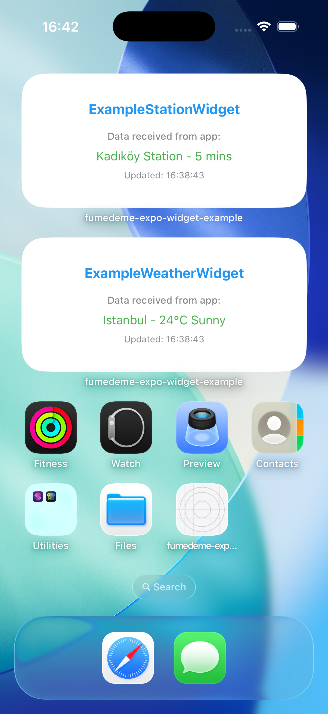
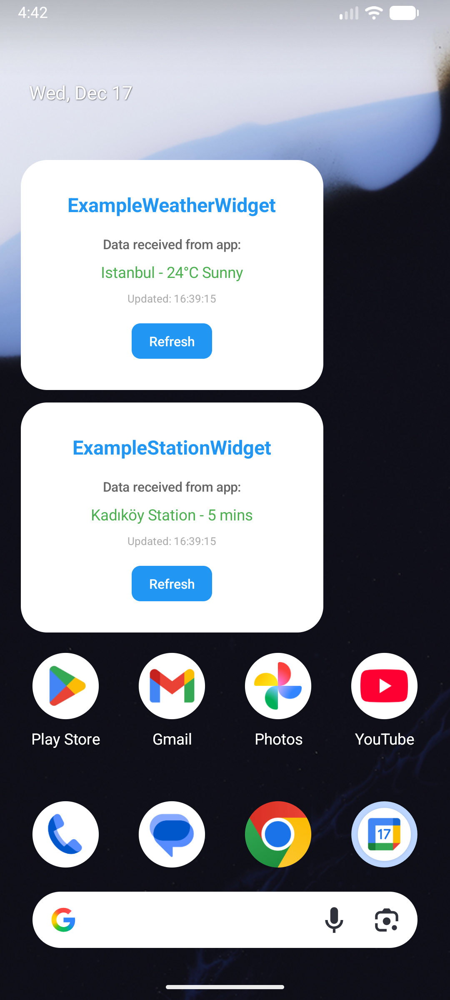
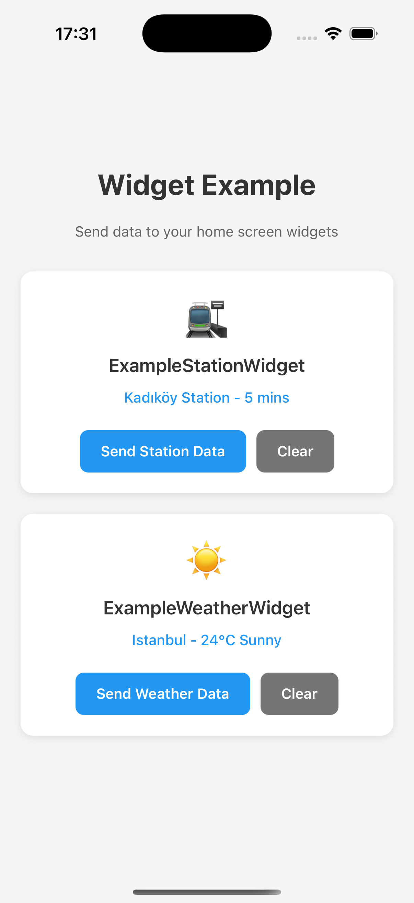

# fumedeme-expo-widget

<p align="center">
  <strong>Native iOS & Android widgets for Expo applications</strong>
</p>

<p align="center">
  <a href="https://www.npmjs.com/package/fumedeme-expo-widget"></a>
  
  
  
  
</p>

<p align="center">
  
    &nbsp;&nbsp;&nbsp;&nbsp;&nbsp;
  
    &nbsp;&nbsp;&nbsp;&nbsp;&nbsp;
  
</p>

---

## Overview

A config plugin that enables native home screen widgets in Expo projects

**Features:**

- Native widget support for iOS and Android platforms
- Multiple widget configurations per project
- Bidirectional data synchronization between app and widgets
- Android Glance API integration
- Persistent widget customization across builds

---

## Installation

```bash
npm install fumedeme-expo-widget
```

## Configuration

### Single Widget

```json
{
  "expo": {
    "plugins": [
      [
        "fumedeme-expo-widget",
        {
          "widgetName": "ExampleStationWidget",
          "ios": {
            "devTeamId": "YOUR_TEAM_ID",
            "appGroupIdentifier": "group.expo.modules.examplestation.example"
          }
        }
      ]
    ]
  }
}
```

**Configuration Options:**

- `widgetName` — Unique widget class name
- `ios.devTeamId` — Apple Developer Team ID
- `ios.appGroupIdentifier` — Shared App Group identifier (must begin with `group.expo.modules`)

### Multiple Widgets

```json
{
  "expo": {
    "plugins": [
      [
        "fumedeme-expo-widget",
        [
          {
            "widgetName": "ExampleStationWidget",
            "ios": {
              "devTeamId": "YOUR_TEAM_ID",
              "appGroupIdentifier": "group.expo.modules.examplestation.example"
            }
          },
          {
            "widgetName": "ExampleWeatherWidget",
            "ios": {
              "devTeamId": "YOUR_TEAM_ID",
              "appGroupIdentifier": "group.expo.modules.exampleweather.example"
            }
          }
        ]
      ]
    ]
  }
}
```

After configuration, run:

```bash
npx expo prebuild --clean
```

## Usage

### Basic Example

```javascript
import { setItem, reloadAll } from "fumedeme-expo-widget";

const GROUP_ID = "group.expo.modules.examplestation.example";

// Write data to shared storage
await setItem("userScore", "1337", GROUP_ID);

// Trigger widget refresh
await reloadAll();
```

### Data Synchronization

```javascript
import { getItem, setItem, reloadAll } from "fumedeme-expo-widget";

const GROUP_ID = "group.expo.modules.exampleweather.example";

// Update widget data
const updateWidget = async (temp, condition) => {
  await setItem("temperature", temp, GROUP_ID);
  await setItem("condition", condition, GROUP_ID);
  await reloadAll();
};

// Read current data
const currentTemp = await getItem("temperature", GROUP_ID);
```

#### Check Example Project for reference.

## Architecture

### Widget File Management

**Initial Prebuild:**

- Creates `/{widgetName}` folder in project root
- Copies template files (Swift for iOS, Kotlin for Android)
- Replaces configuration placeholders
- Files become editable and customizable

**Subsequent Prebuilds:**

- Preserves existing widget customizations
- Updates only configuration values (package names, bundle IDs)
- Copies modified files to native projects

## API Reference

| Function                       | Purpose                       | Example                                    |
| ------------------------------ | ----------------------------- | ------------------------------------------ |
| `setItem(key, value, groupId)` | Save data to shared storage   | `setItem("score", "100", groupId)`         |
| `getItem(key, groupId)`        | Read data from shared storage | `const score =  getItem("score", groupId)` |
| `reloadAll()`                  | Force all widgets to refresh  | `reloadAll()`                              |

---

## Development

### Project Structure

```

fumedeme-expo-widget/
├── src/ # Native module (JS ↔ Native bridge)
├── plugin/
│ ├── src/
│ │ ├── android/static/ # Android widget templates
│ │ ├── ios/static/ # iOS widget templates
│ │ └── \*.ts # Config plugin logic
│ └── build/ # Compiled plugin

```

### Build Process

```bash
npm run build
```

This command:

1. Compiles TypeScript config plugin code
2. Builds native module components
3. Copies widget templates to build directory

---

## Implementation Notes

- **App Groups (iOS):** Required for data sharing between app and widget. Use unique identifiers starting with `group.expo.modules`
- **Widget Updates:** Call `reloadAll()` after data changes to trigger immediate widget refresh
- **Widget Sizing:** Design for small, medium, and large widget variants on both platforms
- **Testing:** Physical devices recommended for accurate widget behavior testing

---

## License

MIT

---

<p align="center">
  <a href="https://github.com/M1FurkanYilmaz/fumedeme-expo-widget">GitHub Repository</a> •
  <a href="https://github.com/M1FurkanYilmaz/fumedeme-expo-widget/issues">Report Issues</a>
</p>
